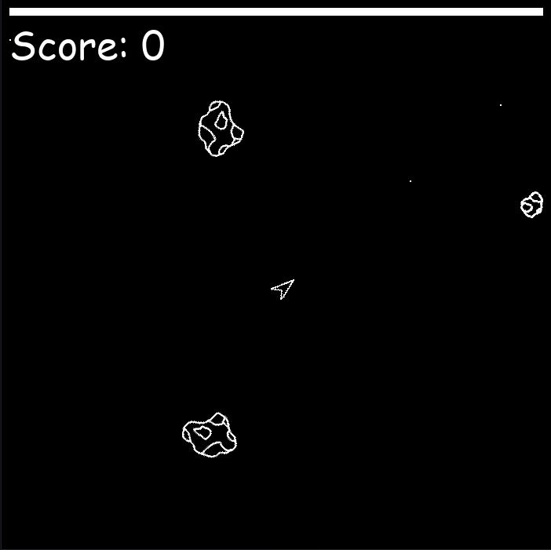

# Description
This is a simple asteroids clone using [pygame](https://www.pygame.org/) and [NEAT](https://neat-python.readthedocs.io/en/latest/#) modules to train an AI agent to play the game. 



This game was originally developed in September 2021 to learn Python and experiment with AI models in preperation for an upcoming school project. The training process can be started and observed, however the model cannot be saved as of now.

# Requirements
- Python 3.6 or later
- pygame
- NEAT-Python

# Installation
To install the required dependencies, run the following command:
``` bash
pip3 install pygame neat-python
```

# Start the training
You only need to run the python script with the following code and the agent will start to play the game.
``` bash
python3 training.py
```
At the moment, the agent does random things, as the fitness value is only tied to the score and movement of the ship. Feel free to adapt this in the `training.py` file using the `g.fitness` variable.

>NOTE: To stop the training at any point, use Ctrl+C in the command line to exit the program entirely.

Currently, the trained model is not saved. This still needs to be implemented.

# How to play yourself
Start the game with
```bash
python3 game.py
```
The bar on top displays your health.
You lose health every time an asteroid hits you.

Move the ship around with the arrow buttons:
:arrow_up: Accelerate
:arrow_left: Rotate counterclockwise
:arrow_right: Rotate clockwise

Shoot the asteroids with the space bar.
Be careful, as bigger ones will split into two.

# Credits
Thanks to Tech With Tim for his [tutorial](https://www.youtube.com/watch?v=MMxFDaIOHsE&list=PLzMcBGfZo4-lwGZWXz5Qgta_YNX3_vLS2&index=1&t=0s) on a Flappy Bird game using NEAT. It was followed and used as an inspiration for this project.
Icon image by <a href="https://pixabay.com/users/clker-free-vector-images-3736/?utm_source=link-attribution&amp;utm_medium=referral&amp;utm_campaign=image&amp;utm_content=27637">Clker-Free-Vector-Images</a> from <a href="https://pixabay.com//?utm_source=link-attribution&amp;utm_medium=referral&amp;utm_campaign=image&amp;utm_content=27637">Pixabay</a>

